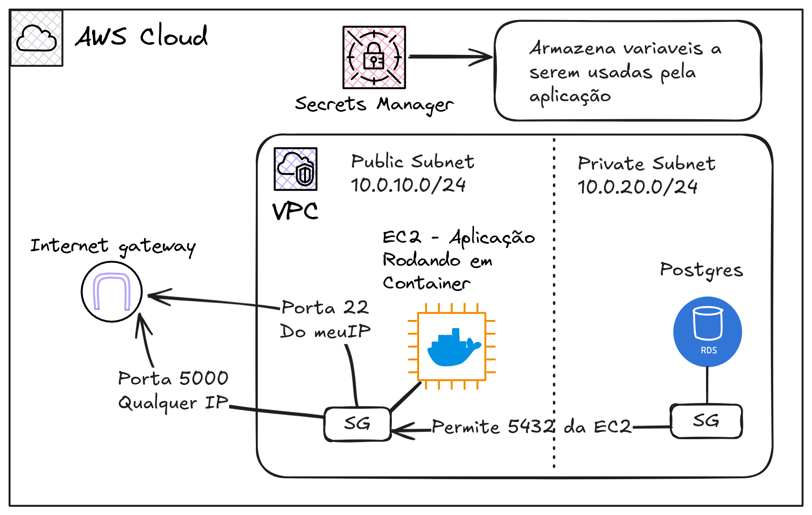
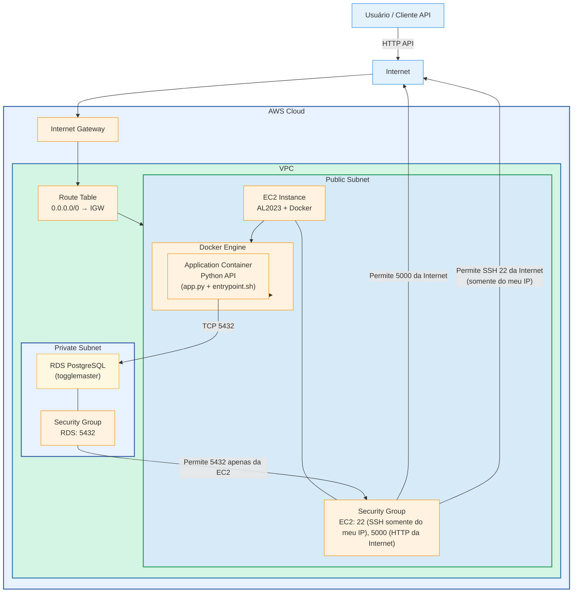
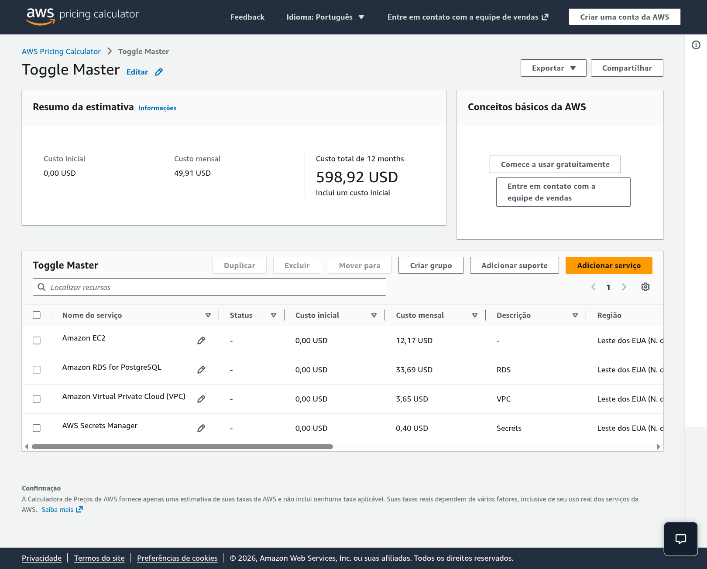

# Tech Challenge 1

Entrega do primeiro tech challenge, turma 3DCLT

## Integrantes

- Assis Berlanda de Medeiros
- Gabriel Espanguero Gonzalez
- João Victor Bueno de Caldas
- Robson Cezar Rodrigues Rocha
- Rogesson Barboza da Silva Souza

## Links

[Vídeo](https://www.loom.com/share/2a5f7aad269b44fa8f6b598bdf42862d)

[Diagrama](https://mermaid.ai/view/2599fdc3-9e3f-4b23-b039-f4663e1e0906)

[AWS Price Calculator](https://calculator.aws/#/estimate?id=91ac163466717b8068294cfb3c12e606db64539f)

## Diagrama de Arquitetura

## Calculadora de Preços AWS

## Relatório de Implementação

Devido a simplicidade da aplicação não houveram muitas dificuldades durante a implementação local. Na máquina de um dos integrantes foi necessário uma adaptação no arquivo do docker-compose devido a um erro de permissão no arquivo app.py, possívelmente devido ao uso do podman para a execução, que foi solucionado com a remoção do mountpoint devido aos arquivos já estão presentes na imagem docker.

O contato com o ecossistema da AWS trouxe desafios iniciais devido a vasta gama de serviços disponíveis no console, dificultando a escolha da ferramenta correta e escolha de serviços com funções equivalentes (como a escolha do internet gateway pela simplicidade ao invés de um NAT gateway com mais controle e custo). Isto também se refletiu durante a estimativa de gastos com a *AWS Pricing Calculator*, se tornando uma importante ferramenta na escolha das soluções utilizadas.

Para o deployment da aplicação na AWS foi utilizado um [script do cloud-init](https://github.com/jobucaldas/toggle-master-monolith/blob/main/cloud-init.sh), recuperando o código do repositório e iniciando a aplicação na criação do container.
Uma dificuldade que essa solução apresentou foi a necessidade de anexar uma role a EC2 criada para que esta pudesse utilizar os secrets que escolhemos utilizar para configuração do ambiente.

## Discussão do 12-Factor App

[Link de Acesso 12 Factor App](https://12factor.net/)

1. [Base de Código](https://12factor.net/pt_br/codebase)

    - [Aderente]: O código da aplicação está hospedado no github em uma unica branch main, a partir da qual é possível instânciar novas implantações conforme necessário.

2. [Dependências](https://12factor.net/pt_br/dependencies)

    - [Aderente]: As depêndencias da aplicação estão definidas no arquivo requirements.txt e não dependem de ferramentas instaladas no sistema, sendo possivel o isolar por meio de virtualenv ou containers.

3. [Configurações](https://12factor.net/pt_br/config)

    - [Aderente]: As configurações da aplicação são recuperadas das variáveis de ambiente, sendo independentes do código.

4. [Serviços de Apoio](https://12factor.net/pt_br/backing-services)

    - [Aderente]: O app utiliza um banco de dados postgres e, por meio de variáveis de ambiente, pode ser alterado por outro banco de dados equivalente a qualquer momento.

5. [Construa, lance, execute](https://12factor.net/pt_br/build-release-run)

    - [Não aderente]: A aplicação não adere a este fator, não há definição de releases e, após o build da aplicação por meio do dockerfile, ainda é possível alterar o código executado (o que é realizado pelo docker-compose).

6. [Processos](https://12factor.net/pt_br/processes)

    - [Aderente]: A aplicação armazena todos os dados importantes em um serviço de apoio (o banco de dados postgresql).

7. [Vínculo de porta](https://12factor.net/pt_br/port-binding)

    - [Aderente]: A aplicação utiliza do webserver gunicorn para disponibilizar acesso aos usuarios, podendo ser facilmente integrada a outras aplicação como uma api.

8. [Concorrência](https://12factor.net/pt_br/concurrency)

    - [Aderente]: Devido a simplicidade da aplicação não há processos concorrentes na aplicação, com o processo sendo contido nas interfaces de manipulação de flags.
    Há também um processo extra que roda na execução da imagem para inicializar o banco de dados.

9. [Descartabilidade](https://12factor.net/pt_br/disposability)

    - [Aderente]: A aplicação inicia rapidamente, com a conexão com o banco de dados confirmada, os requests e conexões subsequentes são realizados conforme os requests chegam e finalizando a conexão em seguida, podendo iniciar e finalizar a qualquer momento.

10. [Dev/prod semelhantes](https://12factor.net/pt_br/dev-prod-parity)

    - [Aderente]: Há paridade entre as ferramentas em uso, com as mesmas ferramentas e integração já configurada sendo disponibilizadas por meio do docker-compose no ambiente dos desenvolvedores.

11. [Logs](https://12factor.net/pt_br/logs)

    - [Parcialmente Aderente]: O migrate da aplicação armazena logs em stdout para acompanhamento de erros durante sua execução, porém erros subsequentes são suprimidos e notificados apenas como retorno dos requests realizados na aplicação, se tornando efetivamente invisiveis para a operação.

12. [Processos de Admin](https://12factor.net/pt_br/admin-processes)

    - [Parcialmente Aderente]: O migrate inicial do banco de dados se encontra atrelado ao Dockerfile do deploy, fazendo parte do código versionado no repositório e sendo executado no mesmo ambiente conteinerizado da aplicação, porém este é executado em toda nova execução da aplicação.
